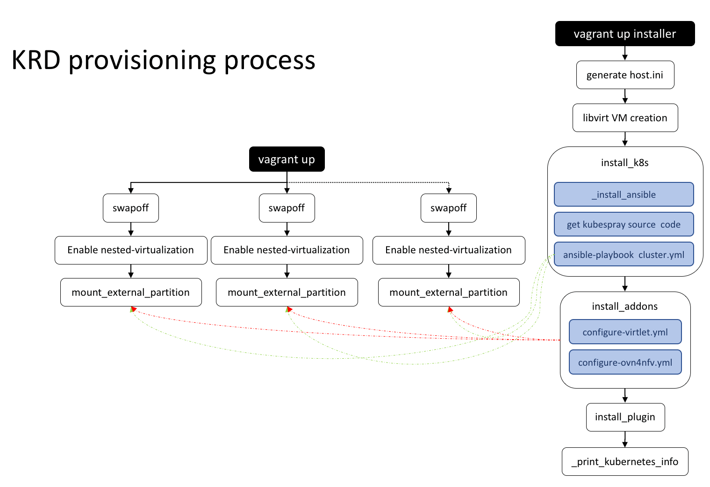
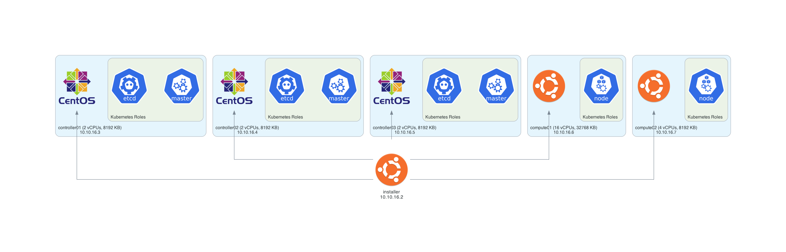

# Kubernetes Reference Deployment

## Summary

This project offers a reference for deploying a Kubernetes cluster.
Its ansible playbooks allow to provision a deployment on Bare-metal
or Virtual Machines.

The *POD Descriptor File (PDF)* is a YAML file which defines the setup used by
KRD. The [default PDF file](config/default.yml) can be overwritten to try
different scenarios. There are different setups located in the
[samples folder](config/samples) which can be used.

## Linux Distros Supported

| Name       | Version           |
|:-----------|:-----------------:|
| Ubuntu     | 16.04/18.04/20.04 |
| CentOS     | 7/8               |
| openSUSE   | Tumbleweed/Leap   |
| Fedora     | 32/33             |

## Components

| Name           | Description                                     | Source                            | Status      |
|:--------------:|:------------------------------------------------|:----------------------------------|:-----------:|
| Kubernetes     | Base Kubernetes deployment                      | [kubespray][1]                    | Done        |
| Virtlet        | Allows to run VMs                               | [configure-virtlet.yml][3]        | Tested      |
| Kubevirt       | Allows to run VMs                               |                                   | Tested      |
| Multus         | Provides Multiple Network support in a pod      |                                   | Tested      |
| NFD            | Node feature discovery                          | [nfd role][4]                     | Tested      |
| Istio          | Service Mesh platform                           |                                   | Tested      |
| PMEM           | Persistent Memory CSI                           | [pmem role][6]                    | Implemented |
| QAT            | QuickAssist Technology Plugin                   | [qat_plugin role][8]              | Tested      |
| SR-IOV         | Single Root Input/Output Virtualization Plugin  | [sriov_plugin role][9]            | Implemented |
| Knative        | Platform for managing serverless workloads      |                                   | Tested      |
| Kong           | Ingress Controller                              |                                   | Tested      |
| HAProxy        | Ingress Controller                              |                                   | Tested      |
| MetalLB        | Provides a network load-balancer implementation |                                   | Tested      |
| Falco          | Deploys a Falco services                        |                                   | Tested      |
| Rook           | Storage Operator                                |                                   | Tested      |
| OPA Gatekeeper | Policy Controller                               |                                   | Tested      |

## Quick Deployment

The [All-in-One bash script](aio.sh) bash script offers the minimal unattended
instructions required for deploying a KRD in a node. It can be externally
consumed with one single command.

    curl -fsSL http://bit.ly/KRDaio | bash

### Installation

The [Environment Setup](CONTRIBUTING.md#environment-setup) section provides the
steps required to install KRD dependencies and define the Cluster setup before
its provisioning.

## Override Default Cluster setup

Vagrant uses the [default configuration](config/default.yml) to define
the Virtual Machines used by the Kubernetes cluster, this
configuration can be overwritten defining the *config/pdf.yml* file.
The **diagram** tox environment generates the *krd.png* file to
visualize the topology of the cluster.

    tox -e diagram

## Install KRD actions

The [KRD command script](krd_command.sh) provides an easy way to
install complementary Kubernetes projects to an existing cluster.
Those projects are grouped in KRD actions and it's possible to get
the current list of current supported actions executing the following
instruction:

    ./krd_command.sh -h

The actions which require the execution of a distributed commands were
implemented through the **install_k8s_addons** KRD action. This action
uses the *KRD_ADDONS_LIST* environment variable to specify the Ansible
playbook to be executed.

    KRD_ADDONS_LIST=virtlet ./krd_command.sh -a install_k8s_addons

> Note: Some KRD AddOns have a corresponding validation script in the
[tests](tests) folder.

## Day-2 Operations

The functions defined in this project covers the life-cycle of a
Kubernetes cluster. In other words, its possible to add more nodes,
upgrade the existing deployment or remove the services.  The following
instruction shows how to upgrade the existing Kubernetes cluster to
*v1.18.10* using the Kubespray version *v2.14.2*:

    KRD_KUBE_VERSION=v1.18.10 KRD_KUBESPRAY_VERSION=v2.14.2 ./krd_command.sh -a upgrade_k8s

### Environment variables

#### Global

| Name                                  | Default                                        | Description                                                                     |
|:--------------------------------------|:-----------------------------------------------|:--------------------------------------------------------------------------------|
| KRD_DEBUG                             | false                                          | Enables verbose execution                                                       |
| KRD_ANSIBLE_DEBUG                     | false                                          | Enables ansible verbose execution                                               |
| PKG_DEBUG                             | false                                          | Enables cURL package installer verbose execution                                |
| KRD_KUBE_VERSION                      |                                                | Specifies the Kubernetes version to be upgraded                                 |
| KRD_KUBESPRAY_VERSION                 | v2.17.0                                        | Specifies the Kubespray version to be used during the upgrade process           |
| KRD_KUBESPRAY_REPO                    | `https://github.com/kubernetes-sigs/kubespray` | Specifies the Git repository to fetch the Kubespray's source code               |
| KRD_ENABLE_TESTS                      | false                                          | Enables the functional tests during the deployment process                      |
| KRD_HELM_CHART                        |                                                | Specifies the Helm chart to be installed                                        |
| KRD_FOLDER                            | /opt/krd                                       | KRD source code destination folder                                              |
| KRD_ACTIONS_LIST                      | install_k8s                                    | Specifies a list of KRD actions to be installed during the All-in-One execution |
| KRD_ADDONS_LIST                       | addons                                         | Specifies the Kubernetes AddOns to be installed by install_k8s_addons           |
| KRD_HUGEPAGES_ENABLED                 | true                                           | Enable/Disable [HugeTLB Pages][17] on cluster nodes                             |
| KRD_QAT_PLUGIN_MODE                   | dpdk                                           | Specifies the deployment mode for Intel QuickAssist Plugin                      |
| KRD_KUBESPHERE_DEVOPS_ENABLED         | true                                           | Enable/Disable [KubeSphere DevOps System][14]                                   |
| KRD_KUBESPHERE_METRICS_SERVER_ENABLED | false                                          | Enable/Disable [Horizontal Pod Autoscaler][15] on KubeSphere                    |
| KRD_KUBESPHERE_SERVICEMESH_ENABLED    | false                                          | Enable/Disable [KubeSphere Service Mesh][16]                                    |
| KRD_ENABLE_ISTIO_ADDONS               | false                                          | Enable/Disable Istio AddOns(Grafana, Kiali and Prometheus)                      |
| KRD_METALLB_ADDRESS_POOLS             |                                                | Specifies a list of L2 address pools for [MetalLB configuration][19]            |

#### Kubespray

| Name                                 | Default | Description                                                                     |
|:-------------------------------------|:--------|:--------------------------------------------------------------------------------|
| KRD_NETWORK_PLUGIN                   | flannel | Choose network plugin (calico, canal, cilium, contiv, flannel weave)            |
| KRD_KUBE_PROXY_MODE                  | ipvs    | Choose kube-proxy mode (iptables, ipvs)                                         |
| KRD_DOWNLOAD_RUN_ONCE                | true    | Download images and binaries only once and then push them to the cluster nodes  |
| KRD_DOWNLOAD_LOCALHOST               | true    | Make localhost the download delegate                                            |
| KRD_MULTUS_ENABLED                   | false   | Enable/Disable [Kubernetes Multus CNI][2]                                       |
| KRD_CONTAINER_RUNTIME                | docker  | Specifies the Container Runtime to be used for deploying kubernetes             |
| KRD_DASHBOARD_ENABLED                | false   | Enable/Disable [Kubernetes Dashboard][12]                                       |
| KRD_CERT_MANAGER_ENABLED             | true    | Enable/Disable [Kubernetes Cert-Manager][10]                                    |
| KRD_INGRESS_NGINX_ENABLED            | true    | Enable/Disable [NGINX Ingress Controller][11]                                   |
| KRD_KATA_CONTAINERS_ENABLED          | false   | Enable/Disable [Kata Containers Runtime][13]                                    |
| KRD_CRUN_ENABLED                     | false   | Enable/Disable [crun][18]                                                       |
| KRD_GVISOR_ENABLED                   | false   | Enable/Disable [gVisor][25]                                                     |
| KRD_FLANNEL_BACKEND_TYPE             | host-gw | Type of flannel backend to use (vxlan, host-gw, udp)                            |
| KRD_MANUAL_DNS_SERVER                |         | Set to use a custom cluster DNS                                                 |
| KRD_REGISTRY_MIRRORS_LIST            |         | Specifies a list of additional registry mirrors                                 |
| KRD_INSECURE_REGISTRIES_LIST         |         | Specifies a list of insecure-registries (IP address or domain name)             |
| KRD_LOCAL_VOLUME_PROVISIONER_ENABLED | true    | Enable/Disable [Local volume provisioner][20]                                   |
| KRD_DOCKER_VERSION                   | latest  | Specifies the Docker version to be used for deploying Kubernetes                |
| KRD_CONTAINERD_VERSION               | latest  | Specifies the ContainerD version to be used for deploying Kubernetes            |
| KRD_ENABLE_NODELOCALDNS              | true    | Enable/Disable [NodeLocal DNSCache][5]                                          |
| KRD_NDOTS                            | 1       | Threshold for the number of dots which must appear in name resolution           |
| KRD_RESOLVCONF_MODE                  | none    | Specifies the DNS setup for non-k8s containers.                                 |
| KRD_KUBE_PROXY_SCHEDULER             | sh      | Specifies the [IPVS scheduling algorithm][7] for allocating connections         |
| KRD_EPHEMERAL_CONTAINERS_ENABLED     | true    | Enable/Disable [Ephemeral Containers][21]                                       |
| KRD_METALLB_ENABLED                  | false   | Enable/Disable [MetalLB load-balancer][22]                                      |
| KRD_METALLB_ADDRESS_POOLS_LIST       |         | Specifies a lists of Layer 2 Address pools for MetalLB                          |
| KRD_KUBERNETES_AUDIT                 | false   | Enable/Disable [Auditing][23]                                                   |
| KRD_KUBERNETES_AUDIT_WEBHOOK         | false   | Enable/Disable [Audit Webhook][23]                                              |
| KRD_AUDIT_WEBHOOK_SERVER_URL         |         | Audit Webhook server URL                                                        |
| KRD_KUBELET_LOGFILES_MAX_NR          | 5       | Maximum number of [container log][24] files that can be present for a container |
| KRD_KUBELET_LOGFILES_MAX_SIZE        | 10Mi    | Maximum size of the [container log][24] file before it is rotated               |

[1]: https://github.com/kubernetes-sigs/kubespray
[2]: https://github.com/k8snetworkplumbingwg/multus-cni
[3]: playbooks/configure-virtlet.yml
[4]: playbooks/roles/nfd
[5]: https://kubernetes.io/docs/tasks/administer-cluster/nodelocaldns/
[6]: playbooks/roles/pmem
[7]: https://man.cx/?page=ipvsadm(8)
[8]: playbooks/roles/qat_plugin
[9]: playbooks/roles/sriov_plugin
[10]: https://cert-manager.io/
[11]: https://kubernetes.github.io/ingress-nginx/
[12]: https://kubernetes.io/docs/tasks/access-application-cluster/web-ui-dashboard/
[13]: https://katacontainers.io/
[14]: https://kubesphere.io/docs/pluggable-components/devops/
[15]: https://kubernetes.io/docs/tasks/run-application/horizontal-pod-autoscale/
[16]: https://kubesphere.io/docs/pluggable-components/service-mesh/
[17]: https://www.kernel.org/doc/html/latest/admin-guide/mm/hugetlbpage.html
[18]: https://github.com/containers/crun
[19]: https://metallb.universe.tf/
[20]: https://github.com/kubernetes-sigs/sig-storage-local-static-provisioner
[21]: https://kubernetes.io/docs/concepts/workloads/pods/ephemeral-containers/
[22]: https://metallb.universe.tf/
[23]: https://kubernetes.io/docs/tasks/debug-application-cluster/audit/
[24]: https://kubernetes.io/docs/concepts/cluster-administration/logging/
[25]: https://gvisor.dev/docs/
