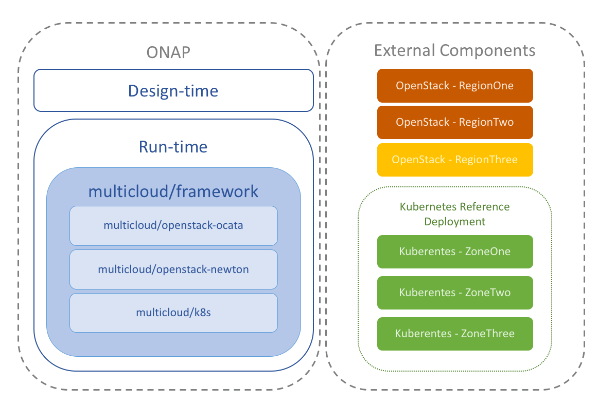

# Kubernetes Reference Deployment

## Summary

This project offers a reference for deploying a Kubernetes cluster
that satisfies the requirements of [ONAP multicloud/k8s plugin][1]. Its
ansible playbooks allow to provision a deployment on Bare-metal or
Virtual Machines.

# Components

| Name           | Description                                   | Source                            | Status      |
|:--------------:|:----------------------------------------------|:----------------------------------|:-----------:|
| Kubernetes     | Base Kubernetes deployment                    | [kubespray][2]                    | Done        |
| OVN            | Opensource Virtual Networking for OpenvSwitch | [configure-ovn.yml][3]            | Done        |
| ovn-kubernetes | Integrates Opensource Virtual Networking      | [configure-ovn-kubernetes.yml][4] | Done        |
| Virtlet        | Allows to run VMs                             | [configure-virtlet.yml][5]        | Done        |
| Multus         | Provides Multiple Network support in a pod    | [multus-cni][6]                   | In progress |

## Deployment

The [installer](installer) bash script contains the minimal
Ubuntu instructions required for running this project.

### Virtual Machines

This project uses [Vagrant tool][7] for provisioning Virtual Machines
automatically. The [setup.sh](setup.sh) bash script contains the
Linux instructions to install dependencies and plugins required for
its usage. This script supports two Virtualization technologies
(Libvirt and VirtualBox).

    $ ./setup.sh -p libvirt

Once Vagrant is installed, it's possible to provision a cluster using
the following instructions:

    $ vagrant up && vagrant up installer

## License

Apache-2.0

[1]: https://git.onap.org/multicloud/k8s
[2]: https://github.com/kubernetes-incubator/kubespray
[3]: playbooks/configure-ovn.yml
[4]: playbooks/configure-ovn-kubernetes.yml
[5]: playbooks/configure-virtlet.yml
[6]: https://github.com/intel/multus-cni
[7]: https://www.vagrantup.com/
