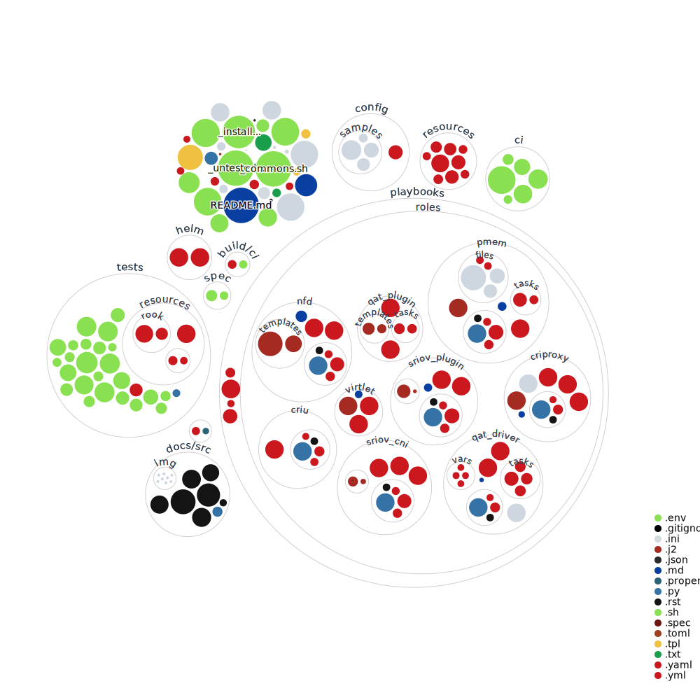

# Kubernetes Reference Deployment

<!-- markdown-link-check-disable-next-line -->

<!-- markdown-link-check-disable-next-line -->

## Summary

KRD (Kubernetes Reference Deployment) is a framework for easily deploying Kubernetes clusters on bare-metal or virtual machines using Ansible.
It provides a configurable and extensible platform for validating Cloud Native technologies across various Linux distributions.

A central concept in KRD is the use of the POD Descriptor File (PDF)—a YAML file that defines your cluster configuration.
You can start with the [default configuration](config/default.yml) or explore [the sample setups](config/samples) for advanced scenarios.

## Supported Linux Distributions

| Distribution |   Version   |
| :----------- | :---------: |
| Ubuntu       | 20.04/22.04 |
| openSUSE     |    Leap     |
| Fedora       | 37/38/39/40 |

## Included Components

KRD integrates a wide range of Kubernetes-related components for testing, benchmarking, or production experimentation:

|       Component       | Description                         | Source                 |     Status     |
| :-------------------: | :---------------------------------- | :--------------------- | :------------: |
|      Kubernetes       | Base Kubernetes deployment          | [kubespray][1]         |    ✅ Done     |
|       Kubevirt        | VM workloads on Kubernetes          |                        |   ✅ Tested    |
|        Virtink        | VM workloads on Kubernetes          |                        |   ✅ Tested    |
|        Multus         | Multi-network pod support           |                        |   ✅ Tested    |
|          NFD          | Node Feature Discovery              | [nfd role][4]          |   ✅ Tested    |
|         Istio         | Service Mesh                        |                        |   ✅ Tested    |
|         PMEM          | Persistent Memory CSI               | [pmem role][6]         | 🚧 Implemented |
|          QAT          | Intel QuickAssist support           | [qat_plugin role][8]   |   ✅ Tested    |
|        SR-IOV         | SR-IOV Plugin                       | [sriov_plugin role][9] | 🚧 Implemented |
|        Knative        | Serverless platform                 |                        |   ✅ Tested    |
|         Kong          | Ingress Controller                  |                        |   ✅ Tested    |
|        HAProxy        | Ingress Controller                  |                        |   ✅ Tested    |
|        MetalLB        | Network load balancer               |                        |   ✅ Tested    |
|         Falco         | Security runtime monitoring         |                        |   ✅ Tested    |
|         Rook          | Storage Operator                    |                        |   ✅ Tested    |
|    OPA Gatekeeper     | Policy Enforcement                  |                        |   ✅ Tested    |
|        Kyverno        | Policy Enforcement                  |                        |   ✅ Tested    |
|      Kubewarden       | Policy Enforcement                  |                        |   ✅ Tested    |
|      kube-monkey      | Chaos engineering for Kubernetes    |                        | 🚧 Implemented |
|        Nephio         | Telco-native orchestration          |                        | 🚧 Implemented |
|        LocalAI        | Local LLM inference support         |                        | 🚧 Implemented |
|        K8SGPT         | Kubernetes diagnostics              |                        | 🚧 Implemented |
|        ArgoCD         | GitOps & CI/CD workflows            |                        | 🚧 Implemented |
|        Tekton         | GitOps & CI/CD workflows            |                        | 🚧 Implemented |
|       Longhorn        | Storage Operator                    |                        |   ✅ Tested    |
|        TopoLVM        | CSI storage with topology awareness |                        |   ✅ Tested    |
|        Fluent         | Logging agent                       |                        |   ✅ Tested    |
|     CloudNativePG     | PostgreSQL operator                 |                        |   ✅ Tested    |
|        LiteLLM        | Local LLM inference support         |                        | 🚧 Implemented |
|        kagent         | KRM-native agentic AI platform      |                        | 🚧 Implemented |
| kube-prometheus-stack | Prometheus stack                    |                        | 🚧 Implemented |

## Quick Deployment

Use the [All-in-One script](aio.sh) for a streamlined, unattended deployment:

    curl -fsSL http://bit.ly/KRDaio | bash

This will clone the repository, install dependencies, and provision a default cluster setup.

## Customizing your Cluster

KRD supports custom cluster definitions using the PDF (YAML) format. Vagrant uses the [default configuration](config/default.yml), but this can be overridden via a `config/pdf.yml` file.

You can also visualize your cluster topology using:

    tox -e diagram

## Installing Add-Ons

Use [KRD command script](krd_command.sh) to install optional components on an existing cluster.

    ./krd_command.sh -h

To install Kubernetes add-ons:

    KRD_ADDONS_LIST=nfd ./krd_command.sh -a install_k8s_addons

> _Note_: Some add-ons include validation scripts in the [tests](tests) directory.

## Day-2 Operations

KRD supports full lifecycle operations, including upgrades, node addition, and service removal.

Example: Upgrade your Kubernetes cluster to version `v1.18.10` using Kubespray `v2.14.2`:

    KRD_KUBE_VERSION=v1.18.10 KRD_KUBESPRAY_VERSION=v2.14.2 ./krd_command.sh -a upgrade_k8s

## Environment Configuration

KRD relies on environment variables to control behavior and customization. Below are some of the most relevant variables.

### Global Variables

| Name                                  | Default                                        | Description                                                                     |
| :------------------------------------ | :--------------------------------------------- | :------------------------------------------------------------------------------ |
| KRD_DEBUG                             | false                                          | Enables verbose execution                                                       |
| KRD_ANSIBLE_DEBUG                     | false                                          | Enables Ansible verbose execution                                               |
| PKG_DEBUG                             | false                                          | Enables cURL package installer verbose execution                                |
| KRD_KUBE_VERSION                      | v1.33.7                                        | Specifies the Kubernetes version to be upgraded                                 |
| KRD_KUBESPRAY_VERSION                 | v2.29.1                                        | Specifies the Kubespray version to be used during the upgrade process           |
| KRD_KUBESPRAY_REPO                    | `https://github.com/kubernetes-sigs/kubespray` | Specifies the Git repository to fetch the Kubespray's source code               |
| KRD_ENABLE_TESTS                      | false                                          | Enables the functional tests during the deployment process                      |
| KRD_HELM_CHART                        |                                                | Specifies the Helm chart to be installed                                        |
| KRD_FOLDER                            | /opt/krd                                       | KRD source code destination folder                                              |
| KRD_ACTIONS_LIST                      | install_k8s                                    | Specifies a list of KRD actions to be installed during the All-in-One execution |
| KRD_ADDONS_LIST                       | addons                                         | Specifies the Kubernetes AddOns to be installed by install_k8s_addons           |
| KRD_HUGEPAGES_ENABLED                 | true                                           | Enable/Disable [HugeTLB Pages][17] on cluster nodes                             |
| KRD_QAT_PLUGIN_MODE                   | dpdk                                           | Specifies the deployment mode for Intel QuickAssist Plugin                      |
| KRD_KUBESPHERE_DEVOPS_ENABLED         | true                                           | Enable/Disable KubeSphere DevOps System                                         |
| KRD_KUBESPHERE_METRICS_SERVER_ENABLED | false                                          | Enable/Disable [Horizontal Pod Autoscaler][15] on KubeSphere                    |
| KRD_KUBESPHERE_SERVICEMESH_ENABLED    | false                                          | Enable/Disable KubeSphere Service Mesh                                          |
| KRD_ENABLE_ISTIO_ADDONS               | false                                          | Enable/Disable Istio AddOns(Grafana, Kiali and Prometheus)                      |
| KRD_METALLB_ADDRESS_POOLS_LIST        |                                                | Specifies a list of L2 address pools for [MetalLB configuration][19]            |

### Kubespray

| Name                                 | Default    | Description                                                                     |
| :----------------------------------- | :--------- | :------------------------------------------------------------------------------ |
| KRD_NETWORK_PLUGIN                   | flannel    | Choose network plugin (calico, canal, cilium, contiv, flannel, weave)           |
| KRD_FLANNEL_BACKEND_TYPE             | host-gw    | Type of flannel backend to use (vxlan, host-gw, udp)                            |
| KRD_CILIUM_TUNNEL_MODE               | disabled   | Encapsulation mode for communication between nodes (disabled, vxlan, geneve)    |
| KRD_CILIUM_KUBE_PROXY_REPLACEMENT    | probe      | Specifies the type of kube-proxy replacement.                                   |
| KRD_CILIUM_ENABLE_BPF_MASQUERADE     | true       | Enable/Disable native IP masquerade support in eBPF                             |
| KRD_CALICO_IPIP_MODE                 | Never      | Configures Calico IP in IP encapsulation (Always, Never, CrossSubnet)           |
| KRD_CALICO_VXLAN_MODE                | Never      | Configures Calico VXLAN encapsulation (Always, Never, CrossSubnet)              |
| KRD_CALICO_NETWORK_BACKEND           | bird       | Configures Calico Network backend (bird, vxlan, none)                           |
| KRD_KUBE_PROXY_MODE                  | ipvs       | Choose kube-proxy mode (iptables, ipvs)                                         |
| KRD_DOWNLOAD_RUN_ONCE                | true       | Download images and binaries only once and then push them to the cluster nodes  |
| KRD_DOWNLOAD_LOCALHOST               | true       | Make localhost the download delegate                                            |
| KRD_MULTUS_ENABLED                   | false      | Enable/Disable [Kubernetes Multus CNI][2]                                       |
| KRD_CONTAINER_RUNTIME                | containerd | Specifies the Container Runtime to be used for deploying kubernetes             |
| KRD_DASHBOARD_ENABLED                | false      | Enable/Disable [Kubernetes Dashboard][12]                                       |
| KRD_CERT_MANAGER_ENABLED             | true       | Enable/Disable [Kubernetes Cert-Manager][10]                                    |
| KRD_INGRESS_NGINX_ENABLED            | true       | Enable/Disable [NGINX Ingress Controller][11]                                   |
| KRD_KATA_CONTAINERS_ENABLED          | false      | Enable/Disable [Kata Containers Runtime][13]                                    |
| KRD_CRUN_ENABLED                     | false      | Enable/Disable [crun][18]                                                       |
| KRD_YOUKI_ENABLED                    | false      | Enable/Disable [youki][26]                                                      |
| KRD_GVISOR_ENABLED                   | false      | Enable/Disable [gVisor][25]                                                     |
| KRD_MANUAL_DNS_SERVER                |            | Set to use a custom cluster DNS                                                 |
| KRD_REGISTRY_MIRRORS_LIST            |            | Specifies a list of additional registry mirrors                                 |
| KRD_INSECURE_REGISTRIES_LIST         |            | Specifies a list of insecure-registries (IP address or domain name)             |
| KRD_LOCAL_VOLUME_PROVISIONER_ENABLED | true       | Enable/Disable [Local volume provisioner][20]                                   |
| KRD_DOCKER_VERSION                   | latest     | Specifies the Docker version to be used for deploying Kubernetes                |
| KRD_CONTAINERD_VERSION               | 1.7.11     | Specifies the ContainerD version to be used for deploying Kubernetes            |
| KRD_ENABLE_NODELOCALDNS              | true       | Enable/Disable [NodeLocal DNSCache][5]                                          |
| KRD_NDOTS                            | 1          | Threshold for the number of dots which must appear in name resolution           |
| KRD_RESOLVCONF_MODE                  | none       | Specifies the DNS setup for non-k8s containers.                                 |
| KRD_KUBE_PROXY_SCHEDULER             | sh         | Specifies the [IPVS scheduling algorithm][7] for allocating connections         |
| KRD_METALLB_ENABLED                  | false      | Enable/Disable [MetalLB load-balancer][22]                                      |
| KRD_METALLB_ADDRESS_POOLS_LIST       |            | Specifies a lists of Layer 2 Address pools for MetalLB                          |
| KRD_KUBERNETES_AUDIT                 | false      | Enable/Disable [Auditing][23]                                                   |
| KRD_KUBERNETES_AUDIT_WEBHOOK         | false      | Enable/Disable [Audit Webhook][23]                                              |
| KRD_AUDIT_WEBHOOK_SERVER_URL         |            | Audit Webhook server URL                                                        |
| KRD_KUBELET_LOGFILES_MAX_NR          | 5          | Maximum number of [container log][24] files that can be present for a container |
| KRD_KUBELET_LOGFILES_MAX_SIZE        | 10Mi       | Maximum size of the [container log][24] file before it is rotated               |
| KRD_CONTAINER_CHECKPOINT_ENABLED     | false      | Enable/Disable [Containers checkpoints creation][21]                            |

## Contribution

KRD is an open-source initiative with contributions from developers, testers, and documenters across the community.

We welcome all forms of collaboration. Please see our [CONTRIBUTING](CONTRIBUTING.md) guide for details.

Thanks to everyone who has contributed so far!

[1]: https://github.com/kubernetes-sigs/kubespray
[2]: https://github.com/k8snetworkplumbingwg/multus-cni
[4]: playbooks/roles/nfd
[5]: https://kubernetes.io/docs/tasks/administer-cluster/nodelocaldns/
[6]: playbooks/roles/pmem
[7]: https://man.cx/?page=ipvsadm(8)
[8]: playbooks/roles/qat_plugin
[9]: playbooks/roles/sriov_plugin
[10]: https://cert-manager.io/
[11]: https://kubernetes.github.io/ingress-nginx/
[12]: https://kubernetes.io/docs/tasks/access-application-cluster/web-ui-dashboard/
[13]: https://katacontainers.io/
[15]: https://kubernetes.io/docs/tasks/run-application/horizontal-pod-autoscale/
[17]: https://www.kernel.org/doc/html/latest/admin-guide/mm/hugetlbpage.html
[18]: https://github.com/containers/crun
[19]: https://metallb.universe.tf/
[20]: https://github.com/kubernetes-sigs/sig-storage-local-static-provisioner
[21]: https://kubernetes.io/blog/2022/12/05/forensic-container-checkpointing-alpha/
[22]: https://metallb.universe.tf/
[23]: https://kubernetes.io/docs/tasks/debug-application-cluster/audit/
[24]: https://kubernetes.io/docs/concepts/cluster-administration/logging/
[25]: https://gvisor.dev/docs/
[26]: https://youki-dev.github.io/youki/
