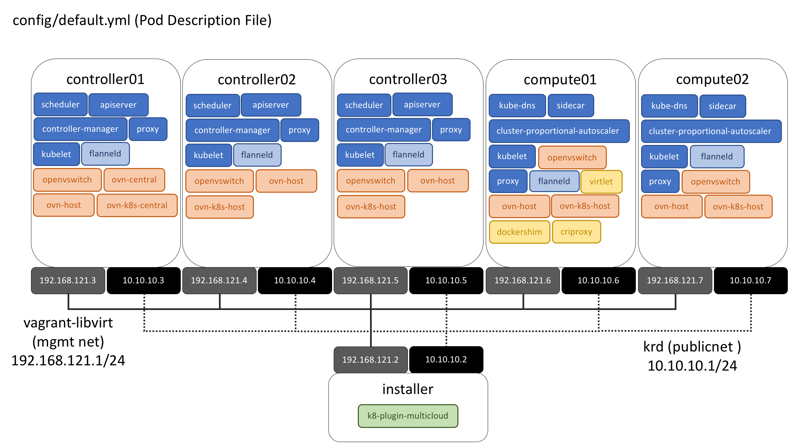

********************
Project Architecture
********************

This document explains the different components of the KRD project
and how they can configured to modify its default behaviour.

Vagranfile
##########

This file describes how the Virtual Machines are going to be
configured and the scripts and arguments used during their
provisioning process. This file uses *elastic/ubuntu-16.04-x86_64*
vagrant box for VirtualBox and Libvirt providers.

config/
#######

This folder contains the POD Descriptor File (PDF) which is used
by Vagrant during the provisioning process. The *samples* folder
contains examples for some setups (All-in-One, Mini, NoHA, HA, etc.)
that can be used.

This list contains the valid entries used by Vagrant to define the virtual
resources used by Vagrant during the creation of the Virtual Machines:

    * ip - The static IP address assigned to the VM. (String value)
    * memory - The amount of memory RAM. (KB - Integer value)
    * cpus - Number of CPUs. (Integer value)
    * volumes - List of volumes to be formatted and mounted to the VM.

config/default.yml
******************

If there is no *pdf.yml* file present in *config* folder, Vagrant will
use the information specified in the **config/default.yml**. The following
diagram displays how the services are installed in the nodes using the 
default configuration.

docs/
#####

This folder contains documentation files using reStructuredText
(RST) syntax. It's possible to generate documentation in  *html*
format using `python tox module <https://tox.readthedocs.io/en/latest/>`_
. Once this is installed, it's possible to build html files using
this following command:

.. code-block:: bash

    tox -e docs

After its execution, the **docs/build** subfolder will contain
subfolders and html files that can be opened from any web browser.

galaxy-requirements.yml
#######################

This file contains third party Ansible roles. Only those tasks which
are not related with the main installation process has been placed in
this file.

installer.sh
############

Main bash script that installs dependencies and executes ansible
playbooks for provisioning KRD components on external nodes. This
script uses some arguments for the additional installation of
components. For more information about its usage:

.. code-block:: bash

    ./installer.sh -h

inventory/
##########

This folder contains the Ansible host inventory file. The
**inventory/host.ini** file, which is used during the execution of 
Ansible playbooks, is created by Vagrant using the values specified
in the *config/pdf.yml* file (or *config/default.yml*).

inventory/group_vars/k8s-cluster.yml
************************************

A preferred practice in Ansible is to not store variables in the
main inventory file. The configuration variables required for 
`Kubespray <https://github.com/kubernetes-incubator/kubespray>`_ are
stored in this file.

node.sh
#######

This bash script is executed in every node after this has been
provisioned. The script provides the possibility to partition and
mount external volumes.

playbooks/
##########

This folder contains a set of Ansible playbooks which performs the
tasks required for configuring services like Multus, Virtlet and/or
OVN.

playbooks/configure-krd.yml
***************************

This ansible playbook collects the common actions among all the
Kubernetes AddOns offered by the KRD.

playbooks/krd-vars.yml
************************

This file centralizes the version numbers and source URLs used for
different components offered by the KRD. Bumping a version requires
extensive testing to ensure compatibility.

setup.sh
########

This bash script is used for the installation and configuration of
dependencies required for the usage of the KRD via Virtual Machines.
Some of this dependencies are:

  - `Vagrant <https://www.vagrantup.com/>`_,
  - `Libvirt <https://libvirt.org/>`_ or `VirtualBox <https://www.virtualbox.org/>`_

The *-p* argument determines the Virtualization provider to be used
and installed in the host machine.

.. code-block:: bash

    ./setup.sh -p libvirt

Vagrant uses VirtualBox as default Virtualization provider. It's
possible to modify this behavior using the global enviroment variable
named **VAGRANT_DEFAULT_PROVIDER**.

.. note::  The execution of this script is recommended only during the initial setup.

tests/
######

This folder contains the health check scripts that guarantees the
proper installation/configuration of Kubernetes AddOns. It's
execution is disabled by default. In order to enable it, it's
necessary to pass the *-t* argument to the **installer.sh** bash
script, usually through changing the arguments in the *Vagrantfile*.
