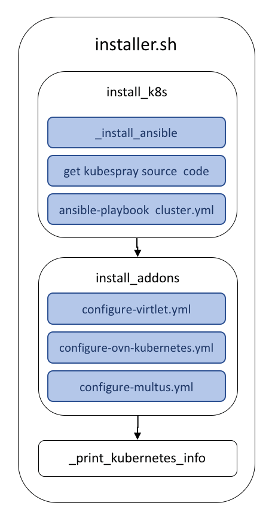

.. Copyright 2018
   Licensed under the Apache License, Version 2.0 (the "License");
   you may not use this file except in compliance with the License.
   You may obtain a copy of the License at
        http://www.apache.org/licenses/LICENSE-2.0
   Unless required by applicable law or agreed to in writing, software
   distributed under the License is distributed on an "AS IS" BASIS,
   WITHOUT WARRANTIES OR CONDITIONS OF ANY KIND, either express or implied.
   See the License for the specific language governing permissions and
   limitations under the License.

***********************
Bare-Metal Provisioning
***********************

The Kubernetes Reference Deployment, aka KRD, has been designed to be
consumed by Virtual Machines as well as Bare-Metal servers. The
*aio.sh* script contains the bash instructions for provisioning an
All-in-One Kubernetes deployment in a Bare-Metal server. This document
lists the Hardware & Software requirements and walkthrough the
instructions that *aio.sh* contains.

Hardware Requirements
#####################

+------------------+--------+
| Concept          | Amount |
+==================+========+
| CPU(amd64,arm64) | 2      |
+------------------+--------+
| Memory           | 7.5GB  |
+------------------+--------+
| Hard Disk        | ~50GB  |
+------------------+--------+

Software Requirements
#####################

- Ubuntu Server +16.04 LTS

aio.sh
######

This bash script provides an automated process for deploying an
All-in-One Kubernetes cluster. 

The following instruction starts the provisioning process.

.. code-block:: bash

    curl -fsSL http://bit.ly/KRDaio | KRD_ACTIONS_LIST="install_k8s,install_cockpit" bash

In overall, this script can be summarized in the following phases:

1. Server validation.
2. Installation of dependencies.
3. Configuration..
4. Deploying KRD services.

**Server validation**

This phase validates that the account of the user running the KRD
scripts is passworless sudo and the IP address has been included as
part of the NO_PROXY values.

**Installation of dependencies**

KRD requires git command line to pulls its source code and also
executes the instructions provided by the *node.sh* script which
installs additional management tools.

**Configuration**

Ansible works against multiple systems, the way for selecting them is
through the usage of the inventory. The inventory file is a static
source for determining the target servers used for the execution of
ansible tasks. The *aio.sh* script creates an inventory file for
addressing those tasks to localhost.

.. code-block:: bash

    cat <<EOL > inventory/hosts.ini
    [all]
    localhost

    [kube-master]
    localhost

    [kube-node]
    localhost

    [etcd]
    localhost

    [k8s-cluster:children]
    kube-node
    kube-master
    EOL

Ansible uses SSH protocol for executing remote instructions. The
following instructions create and register ssh keys which avoid the
usage of passwords.

.. code-block:: bash

    # echo -e "\n\n\n" | ssh-keygen -t rsa -N ""
    # cat ~/.ssh/id_rsa.pub >> ~/.ssh/authorized_keys
    # chmod og-wx ~/.ssh/authorized_keys

**Deploying KRD services**

Finally, the KRD provisioning process can be started through the use
of *krd_command.sh* bash script. The output of this script is
collected in the *krd_${krd_action}.log* file for future reference.

.. code-block:: bash

    # ./krd_command.sh -a "$krd_action" | tee "krd_${krd_action}.log"

