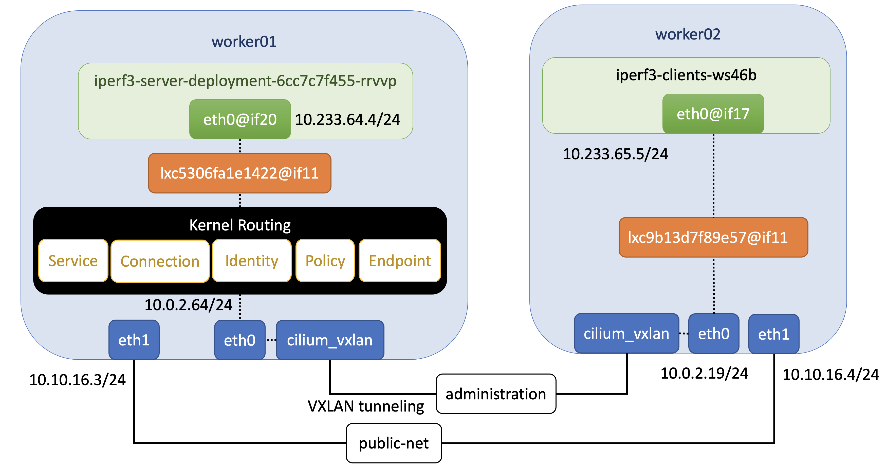

.. Copyright 2022
   Licensed under the Apache License, Version 2.0 (the "License");
   you may not use this file except in compliance with the License.
   You may obtain a copy of the License at
        http://www.apache.org/licenses/LICENSE-2.0
   Unless required by applicable law or agreed to in writing, software
   distributed under the License is distributed on an "AS IS" BASIS,
   WITHOUT WARRANTIES OR CONDITIONS OF ANY KIND, either express or implied.
   See the License for the specific language governing permissions and
   limitations under the License.

***************************************
Tuning Kubernetes Cilium CNI deployment
***************************************

**Software versions**

+--------------+--------------------+
| Name         | Version            |
+==============+====================+
| Ubuntu       | Ubuntu 20.04.4 LTS |
+--------------+--------------------+
| Kernel       | 5.4.0-122-generic  |
+--------------+--------------------+
| Kubernetes   | v1.23.7            |
+--------------+--------------------+
| Cilium       | v1.11.3            |
+--------------+--------------------+

`Cilium <https://cilium.io/>`_ is an open source software for providing,
securing and observing network connectivity between container workloads - cloud
native, and fueled by the revolutionary Kernel technology eBPF. This document
compares results obtained with  *vxlan* and *disabled* tunnel modes.

**VXLAN (Virtual Extensible LAN)**

VXLAN is a network tunneling protocol that uses a VLAN-like encapsulation
technique to encapsulate OSI L2 Ethernet frames within L4 UDP datagrams. This
creates an illusion that containers on the same VXLAN are on the same L2
network.

**Native-Routing**

Cilium will delegate all packets which are not addressed to another local
endpoint to the routing subsystem of the Linux kernel. This means that the
packet will be routed as if a local process would have emitted the packet.

Cilium automatically enables IP forwarding in the Linux kernel when native
routing is configured.

Backend Results
###############

+------------------------+---------------------------+----------------+----------------+----------------+
| Connection             | Measurement               | Native-Routing | VXLAN          | GENEVE         |
+========================+===========================+================+================+================+
| worker01 -> controller | Bitrate(sender)           | 15.8 Gbits/sec | 3.93 Gbits/sec | 4.42 Gbits/sec |
|                        +---------------------------+----------------+----------------+----------------+
|                        | Transfer(sender)          | 18.4 GBytes    | 4.57 GBytes    | 5.15 GBytes    |
|                        +---------------------------+----------------+----------------+----------------+
|                        | CPU Utilization(sender)   | 61.5%          | 12.9%          | 14.4%          |
|                        +---------------------------+----------------+----------------+----------------+
|                        | Bitrate(receiver)         | 15.8 Gbits/sec | 3.92 Gbits/sec | 4.41 Gbits/sec |
|                        +---------------------------+----------------+----------------+----------------+
|                        | Transfer(receiver)        | 18.4 GBytes    | 4.57 GBytes    | 5.14 GBytes    |
|                        +---------------------------+----------------+----------------+----------------+
|                        | CPU Utilization(receiver) | 77.3%          | 67.2%          | 69.7%          |
+------------------------+---------------------------+----------------+----------------+----------------+
| worker02 -> controller | Bitrate(sender)           | 15.4 Gbits/sec | 3.93 Gbits/sec | 4.52 Gbits/sec |
|                        +---------------------------+----------------+----------------+----------------+
|                        | Transfer(sender)          | 17.9 GBytes    | 4.57 GBytes    | 5.27 GBytes    |
|                        +---------------------------+----------------+----------------+----------------+
|                        | CPU Utilization(sender)   | 67.2%          | 13.0%          | 14.3%          |
|                        +---------------------------+----------------+----------------+----------------+
|                        | Bitrate(receiver)         | 15.4 Gbits/sec | 3.93 Gbits/sec | 4.52 Gbits/sec |
|                        +---------------------------+----------------+----------------+----------------+
|                        | Transfer(receiver)        | 17.9 GBytes    | 4.57 GBytes    | 5.26 GBytes    |
|                        +---------------------------+----------------+----------------+----------------+
|                        | CPU Utilization(receiver) | 77.8%          | 66.4%          | 68.1%          |
+------------------------+---------------------------+----------------+----------------+----------------+

Kube-Proxy Replacement: *Probe*

Kube-proxy is running in the Kubernetes cluster where Cilium partially replaces
and optimizes kube-proxy functionality. Once the Cilium agent is up and running,
it probes the underlying kernel for the availability of needed eBPF kernel
features and, if not present, disables a subset of the functionality in eBPF by
relying on kube-proxy to complement the remaining Kubernetes service handling.

***********************************************
Tuning Kubernetes using different Linux Distros
***********************************************

Every Linux distribution can provide a kernel version optimized for running
certain workloads. The following results were obtained running the previous
benchmark function with different Linux distributions. This setup is  using
*Host Gateway* as Flannel CNI backend in a Kubernetes v1.23.7 cluster.

Setup
#####

+------------------+-------+--------+--------------------+-----------------------------+-------------------+
| Hostname         | vCPUs | Memory | Distro             | Kernel                      | Container Runtime |
+==================+=======+========+====================+=============================+===================+
| controller       | 1     | 4 GB   | Ubuntu 18.04.6 LTS | 4.15.0-189-generic          | docker://20.10.11 |
+------------------+-------+--------+--------------------+-----------------------------+-------------------+
| ubuntu18         | 1     | 4 GB   | Ubuntu 18.04.6 LTS | 4.15.0-189-generic          | docker://20.10.11 |
+------------------+-------+--------+--------------------+-----------------------------+-------------------+
| ubuntu20         | 1     | 4 GB   | Ubuntu 20.04.4 LTS | 5.4.0-122-generic           | docker://20.10.11 |
+------------------+-------+--------+--------------------+-----------------------------+-------------------+

Distro Results
##############

+------------+----------------+-------------+
| Hostname   | Bitrate        | Transfer    |
+============+================+=============+
| ubuntu18   | 22.8 Gbits/sec | 19.6 GBytes |
+------------+----------------+-------------+
| ubuntu20   | 20.4 Gbits/sec | 17.5 GBytes |
+------------+----------------+-------------+
