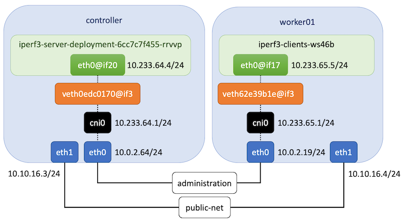

.. Copyright 2021,2022
   Licensed under the Apache License, Version 2.0 (the "License");
   you may not use this file except in compliance with the License.
   You may obtain a copy of the License at
        http://www.apache.org/licenses/LICENSE-2.0
   Unless required by applicable law or agreed to in writing, software
   distributed under the License is distributed on an "AS IS" BASIS,
   WITHOUT WARRANTIES OR CONDITIONS OF ANY KIND, either express or implied.
   See the License for the specific language governing permissions and
   limitations under the License.

****************************************
Tuning Kubernetes Flannel CNI deployment
****************************************

**Software versions**

+--------------+--------------------+
| Name         | Version            |
+==============+====================+
| Ubuntu       | Ubuntu 20.04.4 LTS |
+--------------+--------------------+
| Kernel       | 5.4.0-122-generic  |
+--------------+--------------------+
| Kubernetes   | v1.24.6            |
+--------------+--------------------+
| Flannel      | v1.1.0             |
+--------------+--------------------+

`Flannel CNI <https://www.cni.dev/plugins/current/meta/flannel/>`_ is a simple
and easy way to configure a L3 network fabric designed for Kubernetes. It
supports different backend types for specific scenarios. This document compares
results obtained with  *vxlan* and *host-gw* backends.

**VXLAN (Virtual Extensible LAN)**

VXLAN is a network tunneling protocol that uses a VLAN-like encapsulation
technique to encapsulate OSI L2 Ethernet frames within L4 UDP datagrams. This 
creates an illusion that containers on the same VXLAN are on the same L2
network.

.. image:: ./img/flannel_vxlan.png

**Host Gateway**

Flannel configures each host node as a gateway and replies on routing table to
route the traffics between Pod network and host. Requires direct L2 connectivity
between hosts running Flannel daemon.

Backend Results
###############

+------------------------+---------------------------+----------------+----------------+
| Connection             | Measurement               | host-gw        | VXLAN          |
+========================+===========================+================+================+
| worker01 -> controller | Bitrate(sender)           | 15.6 Gbits/sec | 4.64 Gbits/sec |
|                        +---------------------------+----------------+----------------+
|                        | Transfer(sender)          | 18.2 GBytes    | 5.40 GBytes    |
|                        +---------------------------+----------------+----------------+
|                        | CPU Utilization(sender)   | 74.3%          | 19.7%          |
|                        +---------------------------+----------------+----------------+
|                        | Bitrate(receiver)         | 15.6 Gbits/sec | 4.63 Gbits/sec |
|                        +---------------------------+----------------+----------------+
|                        | Transfer(receiver)        | 18.2 GBytes    | 5.40 GBytes    |
|                        +---------------------------+----------------+----------------+
|                        | CPU Utilization(receiver) | 80.4%          | 71.4%          |
+------------------------+---------------------------+----------------+----------------+
| worker02 -> controller | Bitrate(sender)           | 15.8 Gbits/sec | 4.94 Gbits/sec |
|                        +---------------------------+----------------+----------------+
|                        | Transfer(sender)          | 18.4 GBytes    | 5.75 GBytes    |
|                        +---------------------------+----------------+----------------+
|                        | CPU Utilization(sender)   | 75.1%          | 22.4%          |
|                        +---------------------------+----------------+----------------+
|                        | Bitrate(receiver)         | 15.8 Gbits/sec | 4.94 Gbits/sec |
|                        +---------------------------+----------------+----------------+
|                        | Transfer(receiver)        | 18.4 GBytes    | 5.75 GBytes    |
|                        +---------------------------+----------------+----------------+
|                        | CPU Utilization(receiver) | 79.7%          | 75.2%          |
+------------------------+---------------------------+----------------+----------------+

***********************************************
Tuning Kubernetes using different Linux Distros
***********************************************

Every Linux distribution can provide a kernel version optimized for running
certain workloads. The following results were obtained running the previous
benchmark function with different Linux distributions. This setup is using
*Host Gateway* as Flannel CNI backend in a Kubernetes v1.24.6 cluster.

Setup
#####

+------------------+-------+--------+--------------------+-----------------------------+--------------------+
| Hostname         | vCPUs | Memory | Distro             | Kernel                      | Container Runtime  |
+==================+=======+========+====================+=============================+====================+
| ubuntu16         | 1     | 4 GB   | Ubuntu 16.04.7 LTS | 4.4.0-210-generic           | containerd://1.5.8 |
+------------------+-------+--------+--------------------+-----------------------------+--------------------+
| ubuntu18         | 1     | 4 GB   | Ubuntu 18.04.6 LTS | 4.15.0-189-generic          | containerd://1.5.8 |
+------------------+-------+--------+--------------------+-----------------------------+--------------------+
| ubuntu20         | 1     | 4 GB   | Ubuntu 20.04.4 LTS | 5.4.0-122-generic           | containerd://1.5.8 |
+------------------+-------+--------+--------------------+-----------------------------+--------------------+
| opensuse15       | 1     | 4 GB   | openSUSE Leap 15.4 | 5.14.21-150400.22-default   | containerd://1.5.8 |
+------------------+-------+--------+--------------------+-----------------------------+--------------------+
| fedora34         | 1     | 4 GB   | Fedora 34          | 5.11.12-300.fc34.x86_64     | containerd://1.5.8 |
+------------------+-------+--------+--------------------+-----------------------------+--------------------+
| fedora35         | 1     | 4 GB   | Fedora Linux 35    | 5.14.10-300.fc35.x86_64     | containerd://1.5.8 |
+------------------+-------+--------+--------------------+-----------------------------+--------------------+
| centos7          | 1     | 4 GB   | CentOS Linux 7     | 3.10.0-1160.71.1.el7.x86_64 | containerd://1.5.8 |
+------------------+-------+--------+--------------------+-----------------------------+--------------------+
| centos8          | 1     | 4 GB   | CentOS Linux 8     | 4.18.0-348.7.1.el8_5.x86_64 | containerd://1.5.8 |
+------------------+-------+--------+--------------------+-----------------------------+--------------------+

Distro Results
##############

+------------+----------------+-------------+
| Hostname   | Bitrate        | Transfer    |
+============+================+=============+
| ubuntu18   | 20.4 Gbits/sec | 23.8 GBytes |
+------------+----------------+-------------+
| ubuntu20   | 15.4 Gbits/sec | 18.0 GBytes |
+------------+----------------+-------------+
| centos7    | 17.7 Gbits/sec | 20.6 GBytes |
+------------+----------------+-------------+
