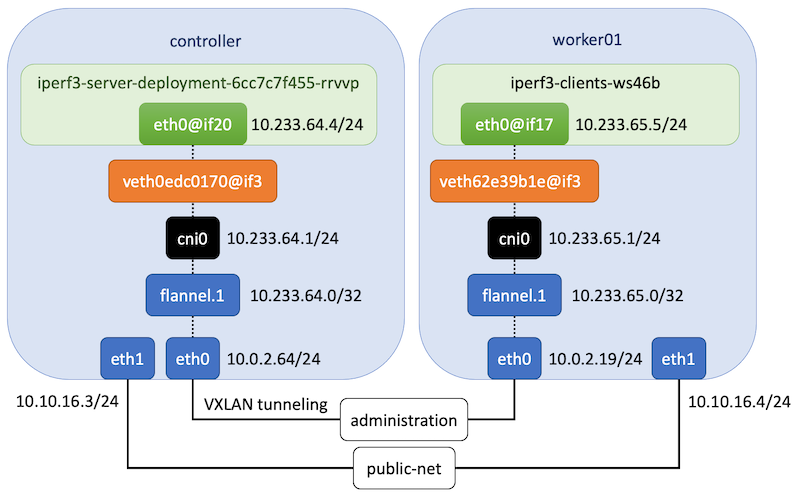

.. Copyright 2021,2022
   Licensed under the Apache License, Version 2.0 (the "License");
   you may not use this file except in compliance with the License.
   You may obtain a copy of the License at
        http://www.apache.org/licenses/LICENSE-2.0
   Unless required by applicable law or agreed to in writing, software
   distributed under the License is distributed on an "AS IS" BASIS,
   WITHOUT WARRANTIES OR CONDITIONS OF ANY KIND, either express or implied.
   See the License for the specific language governing permissions and
   limitations under the License.

****************************************
Tuning Kubernetes Flannel CNI deployment
****************************************

Overview
========

`Flannel CNI <https://www.cni.dev/plugins/current/meta/flannel/>`_ is a simple and
easy way to configure a Layer 3 network fabric for Kubernetes. It supports various
backend types tailored for different networking scenarios.

This document compares performance results using the following Flannel backends:

- ``vxlan``
- ``host-gw``

Software Versions
=================

+--------------+--------------------+
| Name         | Version            |
+==============+====================+
| Ubuntu       | Ubuntu 20.04.6 LTS |
+--------------+--------------------+
| Kernel       | 5.4.0-169-generic  |
+--------------+--------------------+
| Kubernetes   | v1.28.6            |
+--------------+--------------------+
| Flannel      | v0.22.0            |
+--------------+--------------------+

Backend Types
=============

VXLAN (Virtual Extensible LAN)
------------------------------

VXLAN encapsulates Layer 2 Ethernet frames within Layer 4 UDP datagrams, simulating a
virtual Layer 2 domain across host boundaries.

Host-GW (Host Gateway)
----------------------

In host-gw mode, Flannel configures each host as a gateway. Traffic between pods on
different nodes is routed using the kernel's native routing table. This requires
Layer 2 connectivity between all nodes.

Performance results by backend
==============================

+------------------------+---------------------------+----------------+----------------+
| Connection             | Measurement               | host-gw        | VXLAN          |
+========================+===========================+================+================+
| worker01 -> controller | Bitrate(sender)           | 15.6 Gbits/sec | 4.64 Gbits/sec |
|                        +---------------------------+----------------+----------------+
|                        | Transfer(sender)          | 18.2 GBytes    | 5.40 GBytes    |
|                        +---------------------------+----------------+----------------+
|                        | CPU Utilization(sender)   | 74.3%          | 19.7%          |
|                        +---------------------------+----------------+----------------+
|                        | Bitrate(receiver)         | 15.6 Gbits/sec | 4.63 Gbits/sec |
|                        +---------------------------+----------------+----------------+
|                        | Transfer(receiver)        | 18.2 GBytes    | 5.40 GBytes    |
|                        +---------------------------+----------------+----------------+
|                        | CPU Utilization(receiver) | 80.4%          | 71.4%          |
+------------------------+---------------------------+----------------+----------------+
| worker02 -> controller | Bitrate(sender)           | 15.8 Gbits/sec | 4.94 Gbits/sec |
|                        +---------------------------+----------------+----------------+
|                        | Transfer(sender)          | 18.4 GBytes    | 5.75 GBytes    |
|                        +---------------------------+----------------+----------------+
|                        | CPU Utilization(sender)   | 75.1%          | 22.4%          |
|                        +---------------------------+----------------+----------------+
|                        | Bitrate(receiver)         | 15.8 Gbits/sec | 4.94 Gbits/sec |
|                        +---------------------------+----------------+----------------+
|                        | Transfer(receiver)        | 18.4 GBytes    | 5.75 GBytes    |
|                        +---------------------------+----------------+----------------+
|                        | CPU Utilization(receiver) | 79.7%          | 75.2%          |
+------------------------+---------------------------+----------------+----------------+

***********************************************
Tuning Kubernetes using different Linux Distros
***********************************************

Linux distributions often ship with kernels optimized for specific workloads. The following
performance data was collected by running the same Flannel host-gw benchmark across various
Linux distributions in a Kubernetes v1.24.6 cluster.

Test Setup
==========

+------------------+-------+--------+--------------------+-----------------------------+--------------------+
| Hostname         | vCPUs | Memory | Distro             | Kernel                      | Container Runtime  |
+==================+=======+========+====================+=============================+====================+
| ubuntu16         | 1     | 4 GB   | Ubuntu 16.04.7 LTS | 4.4.0-210-generic           | containerd://1.5.8 |
+------------------+-------+--------+--------------------+-----------------------------+--------------------+
| ubuntu18         | 1     | 4 GB   | Ubuntu 18.04.6 LTS | 4.15.0-189-generic          | containerd://1.5.8 |
+------------------+-------+--------+--------------------+-----------------------------+--------------------+
| ubuntu20         | 1     | 4 GB   | Ubuntu 20.04.4 LTS | 5.4.0-122-generic           | containerd://1.5.8 |
+------------------+-------+--------+--------------------+-----------------------------+--------------------+
| opensuse15       | 1     | 4 GB   | openSUSE Leap 15.4 | 5.14.21-150400.22-default   | containerd://1.5.8 |
+------------------+-------+--------+--------------------+-----------------------------+--------------------+
| fedora34         | 1     | 4 GB   | Fedora 34          | 5.11.12-300.fc34.x86_64     | containerd://1.5.8 |
+------------------+-------+--------+--------------------+-----------------------------+--------------------+
| fedora35         | 1     | 4 GB   | Fedora Linux 35    | 5.14.10-300.fc35.x86_64     | containerd://1.5.8 |
+------------------+-------+--------+--------------------+-----------------------------+--------------------+
| centos7          | 1     | 4 GB   | CentOS Linux 7     | 3.10.0-1160.71.1.el7.x86_64 | containerd://1.5.8 |
+------------------+-------+--------+--------------------+-----------------------------+--------------------+
| centos8          | 1     | 4 GB   | CentOS Linux 8     | 4.18.0-348.7.1.el8_5.x86_64 | containerd://1.5.8 |
+------------------+-------+--------+--------------------+-----------------------------+--------------------+

.. note::
   Flannel host-gw mode requires direct Layer 2 connectivity between nodes.

Performance results by distro
=============================

+------------+----------------+-------------+
| Hostname   | Bitrate        | Transfer    |
+============+================+=============+
| ubuntu18   | 20.4 Gbits/sec | 23.8 GBytes |
+------------+----------------+-------------+
| ubuntu20   | 15.4 Gbits/sec | 18.0 GBytes |
+------------+----------------+-------------+
| centos7    | 17.7 Gbits/sec | 20.6 GBytes |
+------------+----------------+-------------+
